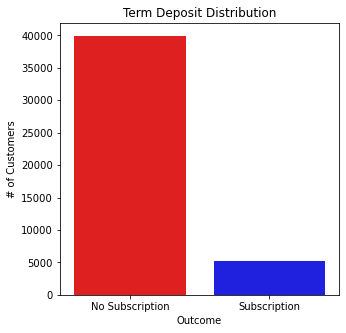
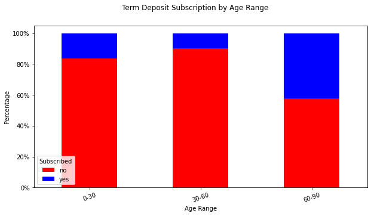
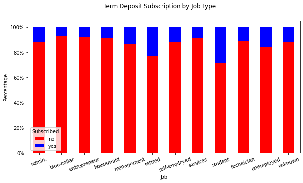
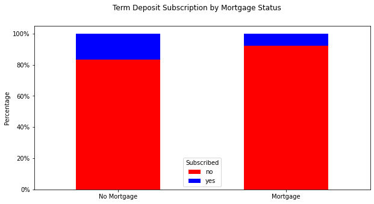

# Overview
My goal for this project was to advise a retail bank as to how it may increase its return on investment (ROI) on financial products it sells to clients. Specifically, the bank's objectives were to increase subscription revenue from term deposits while simultaneously decreasing its customer acquisition costs. To help the bank achieve its goals, I first sought to analyze its historical data on term deposits, and gain insight about the customers who sign up for this product. Second, I sought to train a model on their data that could predict future customer subscription. At the end of my analysis, I present a data-driven marketing and sales strategy that should enable the bank to accomplish its goal of increasing term deposit ROI.
# Business Understanding
A term deposit is a financial product whereby a customer agrees to lock up funds with the bank for a fixed period of time, and in doing so they receive a guaranteed rate of return. It’s an important source of bank revenue, but there are a few unique challenges that accompany its growth. Not everyone wants to, or can afford to lock up funds for an extended period of time. Many people live paycheck to paycheck and need to maintain access to liquidity. Additionally, the rate of return for a term deposit tends to be modest, which makes it unattractive to customers who would prefer alternative investments with a greater potential return. Another unique challenge to my stakeholder is that they have historically relied on expensive,  labor-intensive call centers to run telemarketing campaigns. This makes it difficult to grow subscription revenue without growing the customer acquisition costs. Therefore, it is crucial to implement a targeted marketing and sales strategy that optimizes ROI over revenue growth. Fortunately, machine learning and exploratory data analysis can be used to identify which customers should be targeted, and craft an efficient strategy going forward. 
# Data Understanding 
The dataset I used came from Kaggle and can be found here: https://www.kaggle.com/datasets/prakharrathi25/banking-dataset-marketing-targets 
 
It consists of 45,211 rows of data pertaining to customers of a Portuguese retail bank and includes a number of demographic attributes as well as information about a prior telemarketing campaign. The target column in the original dataset is ‘y’, which I renamed ‘made_deposit’ in my analysis. The following is a description of the feature columns:
1. age (numeric)
2. job (categorical: "admin.","unknown","unemployed","management","housemaid","entrepreneur","student",
"blue-collar","self-employed","retired","technician","services")
3. marital : marital status (categorical: "married","divorced","single"; note: "divorced" means divorced or widowed)
4. education (categorical: "unknown","secondary","primary","tertiary")
5. default: has credit in default? (binary: "yes","no")
6. balance: average yearly balance, in euros (numeric)
7. housing: has housing loan? (binary: "yes","no")
8. loan: has personal loan? (binary: "yes","no")
9. contact: contact communication type (categorical: "unknown","telephone","cellular")
10. day: last contact day of the month (numeric)
11. month: last contact month of year (categorical: "jan", "feb", "mar", …, "nov", "dec")
12. duration: last contact duration, in seconds (numeric)
13. campaign: number of contacts performed during this campaign and for this client (numeric, includes last contact)
14. pdays: number of days that passed by after the client was last contacted from a previous campaign (numeric, -1 means client was not previously contacted)
15. previous: number of contacts performed before this campaign and for this client (numeric)
16. poutcome: outcome of the previous marketing campaign (categorical: "unknown","other","failure","success")
# Exploratory Data Analysis
The distribution of the target variable is visualized in the plot below. Subscription rate was 11.70% which implies the dataset is disproportionate in that it has substantially more samples of customers who did not subscribe than customers who did subscribe to a term deposit. Later in my analysis, I utilize SMOTE as an oversampling technique to account for this class imbalance. 



I then wanted to gain insights about the types of customers who have historically subscribed to term deposits. I created a number of visualizations which can be seen in the jupyter notebook that look at subscription rate given a certain attribute. The following visualizations stood out to me as potential areas for strategic action:



When comparing subscription rate by age I chose to bin the customers into 3 ranges, each representing a distinct stage of life. As you can see in the plot above, subscription is greatest in the oldest age group consisting of 60-90 year olds, followed by the young 0-30 age group, and then the lowest subscription rates are found in the middle 30-60 year old age group.



When grouping customers by employment, the results tell a similar story to the previous finding about the young and old age groups. As you can see, the 2 groups with the highest subscription rates are students and retirees, and the lowest rates are among members of the workforce who primarily fall into the middle age category. 



In this plot I looked at subscription rate vs. mortgage status. As you can see, customers with a mortgage were less likely to subscribe to a term deposit. 

Given the nature of term deposits, these findings make sense for a few reasons. The middle aged workforce demographic is in the prime of their earning years and likely needs to make mortgage payments. Therefore, locking up funds and thus giving up liquidity for a relatively low rate of return is either less feasible or less attractive to them as it may be to a student who probably doesn't have a mortgage, or to a retiree who probably has a low risk appetite. 
# Modeling
The baseline dummy model, which predicts the majority class, has an accuracy score of about 88%. My goal was to create a number of different predictive models and iterations to see if the baseline accuracy score could be improved upon.

The first step in my modeling process was to perform data preprocessing. I created a new column called ‘made_deposit_binary’, which assigned a 0 to customers who did not subscribe and a 1 to customers who did subscribe to a term deposit. I then created a numeric pipeline to StandardScale numeric data, and a categorical pipeline to OneHotEncode categorical data. I then assigned variables to the numeric and categorical feature columns, and instantiated a column transformer containing the mini pipelines. My next step was to assign variables to my predictors and target, and then split the data into a training and test set. To easily obtain cross validation scores and visualize my models, I imported the "ModelWithCV()" class provided by Flatiron which uses 10 as the kfolds parameter. As I mentioned earlier, there is a class imbalance in this dataset. To account for this, I used the SMOTE oversampling technique, however the results did not show any accuracy improvement over the models without SMOTE. I then utilized GridSearch in order to perform hyperparameter tuning. 
In the next section, I discuss the results of my final model. 
# Final Evaluation

# Recommendations
The bank needs to capitalize on the high yield customers who are already a natural fit for a term deposit. Based on my findings, high yield customers include the young and old age groups, students, retirees, and people without a mortgage. However, my model should be used to make predictions about individual customers and group them accordingly. Recognizing that call centers are effective yet expensive, I recommend that the bank start its next campaign with a lean call center that is specifically dedicated to converting that small pool of high yield customers. As for the low yield customers, I would recommend targeting them with an automated email campaign that offers promotions that fit their specific needs. For example, a flexible duration deposit whereby they could access liquidity sooner than normal. 
# Next Steps
The strategy that I outlined today should help the bank maximize future subscriptions, and minimize customer acquisition costs. However, as time goes on, new factors will inevitably influence whether or not a customer is likely to subscribe. Therefore, my model should continue to be used, updated and fine tuned as more data becomes available. I’m also working on an application to deploy the model, which I hope to have available soon. 
## For More Information   

See the full analysis in the [Jupyter Notebook](./Final_Notebook/Jupyter_Notebook.ipynb) or review this [presentation](./presentation.pdf).

**For additional info, contact:**
- Zach Cherna: zacharycherna@gmail.com


## Repository Structure

```

├── Data
│   ├── train_banking.csv
├── Final_Notebook
│   ├── Jupyter_Notebook.ipynb
├── Images
│   ├── age_range.png
│   ├── job_type.png
│   ├── mortgage.png
│   ├── slides_header.png
│   ├── term_deposit_distribution.png
├── Presentation
│   ├── presentation.pdf
├── .gitignore
└── README.md
```


